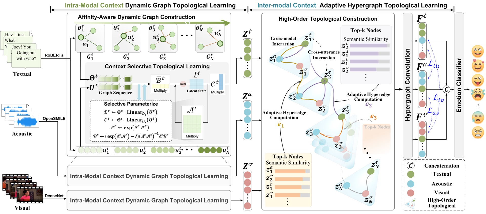

# Source Code for AAAI2026 Submission [I$^2$DTL: Intra- and Inter-modal Dual-Context Topological Learning for Emotion Recognition in Conversations]

## Overview

In this work, we propose **I^2DTL**, a novel **I**ntra- and **I**nter-modal **D**ual-context **T**opological **L**earning network for ERC. Specifically, we first design an intra-modal context dynamic graph topological learning strategy, which captures both short- and long-range contextual dependencies within each modality (i.e., textual, acoustic, and visual) by leveraging the temporal dynamics of emotional cues. Then, we introduce an inter-modal context adaptive hypergraph topological learning network, which not only explores high-order cross-modal and cross-utterance contextual relationships but also refines multimodal representations to enhance discriminability via a cross-modal contrastive loss. 

<div align="center">
    <p>
    
    </p>
    

</div>

## Contents

In adherence to the double-blind review process and to focus on the core contribution, this repository currently includes only the implementation of the proposed model architecture's core components.

Specifically, you will find code related to:

1.  **Intra-modal Context Dynamic Graph Topological Learning (ICDGTL):** Implementation of the module designed to capture short- and long-range contextual dependencies within modalities (related files might be found under `selective_modeling`, particularly `graph_selective_modeling.py`).
2.  **Inter-modal Context Adaptive Hypergraph Topological Learning (ICAHTL):** Implementation of the module for modeling high-order cross-utterance cross-modal contextual relationships (see `adaptive_hypergraph.py`, potentially `HGCN.py`).
3.  **Overall Model Integration:** The main script assembling these components (i.e. `model.py`).
4.  Utility functions (`utils.py`, `graph_adj.py`).

## Requirements

Key requirements include:
```bash
Python == 3.10.13
torch == 2.1.2+cu118
torch-geometric == 2.6.1
torch-scatter == 2.1.2+pt21cu118       
torch-sparse == 0.6.18+pt21cu118      
torchaudio == 2.1.2+cu118           
torchvision == 0.16.2+cu118  
mamba-ssm == 1.1.1
causal-conv1d == 1.5.0.post8              
numpy == 1.26.3  
pandas == 2.2.3 
scikit-learn == 1.6.0 
scipy == 1.14.1
```

